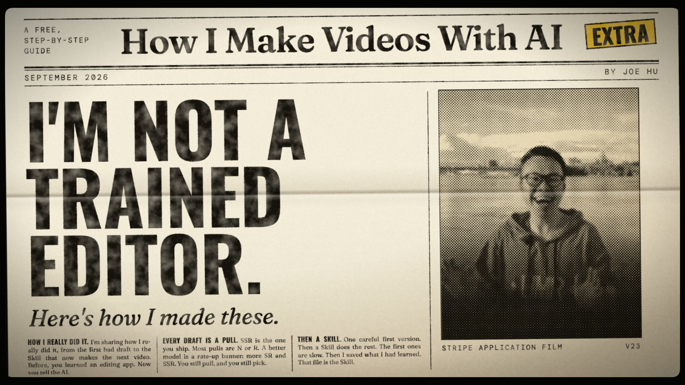

# How I Make Videos With AI

[](https://hubeiqiao.com/video-guide)

I'm not a trained editor. Every video I've posted since March, more than 100, I made by telling an AI coding tool (Claude Code or Codex) what I want, watching every draft and writing notes until it is right. Nothing is generated: the AI writes the video as code (Remotion) from my own photos and clips, so every note changes exactly what I point at. Almost none of them came out in one shot.

This is the free kit from my guide, [How I Make Videos With AI](https://hubeiqiao.com/video-guide): the five steps written as a Skill for your assistant (a note of rules it reads before it starts), every prompt from the guide, and six Skills I saved from my own videos as examples. The steps are the same with any model.

You don't need to know how to edit. You need to know what you want.

## Your first hour

1. **Get Claude Code** (or Codex). Pick Opus 5.5. Medium effort is the default; go higher for better drafts.
2. **Add the Skill.** Just tell your assistant:

   ```text
   Install the make-a-video Skill from github.com/hubeiqiao/how-i-make-videos-with-ai
   ```

   Or run `npx skills add hubeiqiao/how-i-make-videos-with-ai`, or copy the `skills` folder into your project.
3. **Say what you want.** Put 10 to 30 of your own photos or clips in one folder, open that folder in your assistant and send:

   ```text
   Use the make-a-video Skill. Make a 30-second video from the files in this folder. It is for [who will watch]. After watching, they should [believe or do one thing].
   ```

4. **React to your first draft.** The first time, the assistant sets up the folders and a small Remotion project, then renders a whole draft from your files. Watch it and write your first note.

You never edit a timeline or the code.

## The five steps

1. **Know what you want. Then gather your files.** Done when every part of your outline points to a real file.
2. **Get the whole draft once. Then react.** Done when a playable video exists from the first word to the last.
3. **Point at the problem. Fix one section at a time.** Done when every section has an approved file and you have nothing left to say.
4. **Put it together. Listen at every join.** Done when you can watch it end to end without wincing once.
5. **Finish where people see it. If you'll make this kind of video again, save the recipe as a Skill.** Done when the post preview looks right.

A useful note has four parts: where, what's wrong, what you want, what must stay.

## What's inside

| Path | What it is |
| --- | --- |
| [`skills/make-a-video/`](skills/make-a-video/SKILL.md) | the five steps, written for your assistant. Start here. |
| [`skills/`](skills/README.md) | six more Skills I saved from my own videos, as examples |
| [`all-prompts.txt`](all-prompts.txt) | every prompt from the guide, if you would rather paste them yourself |
| [`one-page-workflow.pdf`](one-page-workflow.pdf) | the whole method on one printable page |

## The example Skills

Each one was written the way step 5 describes: after a video was approved, the assistant turned my notes and the drafts I rejected into rules. Read one to see what a saved Skill looks like, or use it if your job is the same.

| Skill | Use it to |
| --- | --- |
| [evidence-led-film](skills/evidence-led-film/SKILL.md) | make a film from your real work |
| [joe-speaking-video](skills/joe-speaking-video/SKILL.md) | turn a recording into a finished episode |
| [ai-candidate-growth-short](skills/ai-candidate-growth-short/SKILL.md) | cut a finished episode into a short |
| [joe-speaking-talk-cut](skills/joe-speaking-talk-cut/SKILL.md) | turn a recording of your talk into a published cut |
| [joe-speaking-release-preview-video](skills/joe-speaking-release-preview-video/SKILL.md) | make a short preview for each app release |
| [joe-speaking-feature-in-app-video](skills/joe-speaking-feature-in-app-video/SKILL.md) | turn a screen recording into an in-app feature video |

Where a Skill names my app or my videos, it shows where a rule came from. Use your own.

In Claude Code you can also add all seven as a plugin:

```text
/plugin marketplace add hubeiqiao/how-i-make-videos-with-ai
/plugin install how-i-make-videos-with-ai@how-i-make-videos-with-ai-marketplace
```

For better Remotion code, also add the [official Remotion Skill](https://www.remotion.dev/docs/ai/skills):

```bash
npx skills add remotion-dev/skills
```

## Made something with it?

Open an issue with the "I made a video with this kit" form. Link the video and say which steps or Skills you used.

## License

- The Skills, prompts and guides are MIT licensed. See [LICENSE](LICENSE).
- The make-a-video Skill has your assistant set up [Remotion](https://www.remotion.dev) on your computer. Remotion has its own license: it is free for individuals, non-profits and companies of up to three employees, and larger companies need a company license. Check [its terms](https://www.remotion.dev/license) for your use.

Made by [Joe Hu](https://hubeiqiao.com).
